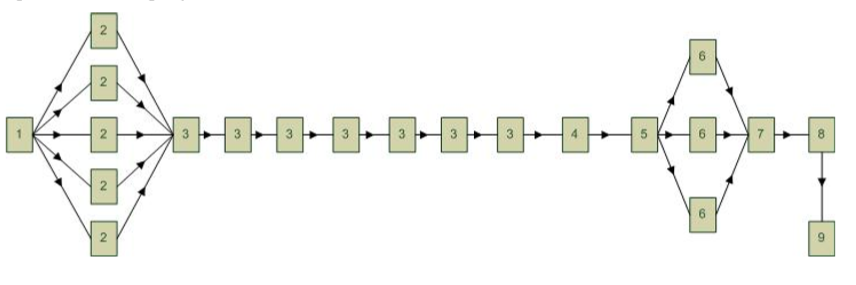
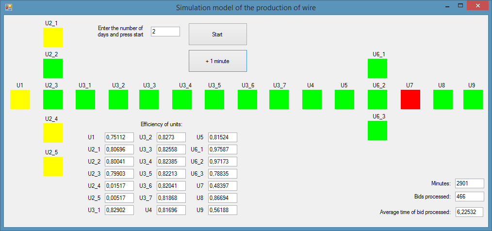

#Simulation model of the wire producing plant

Author: Grozov Roman

This is simulation model written in C#. Production of wires in this process wherein the initial preform (bloom) sequentially passes through 9 units. Simulated system belongs to a class of queuing systems.

The program allows to simulate the operation of the plant over time, to identify weaknesses and to determine the efficiency of the production units.

